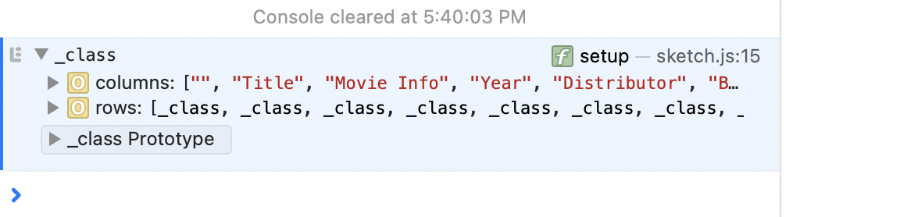
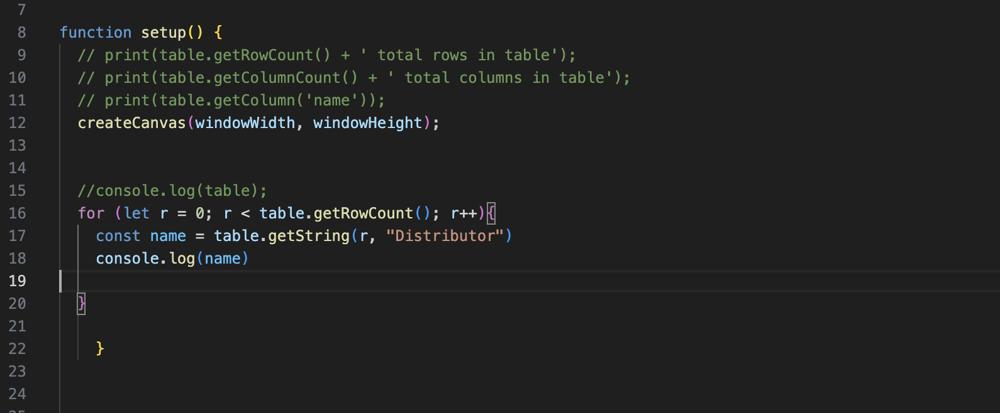
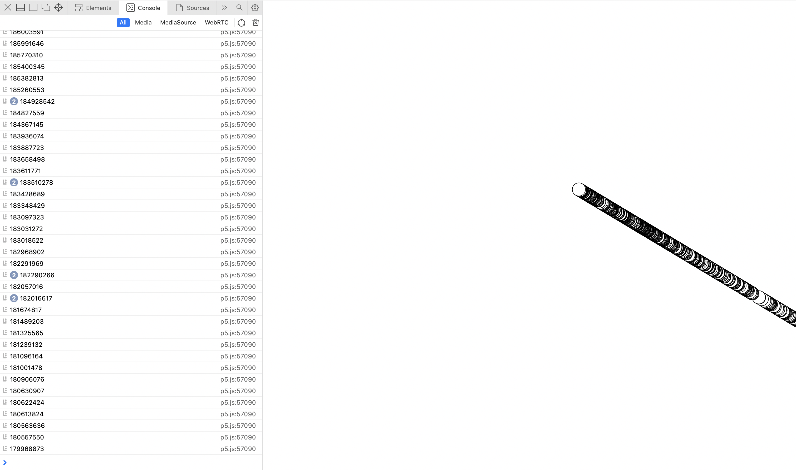
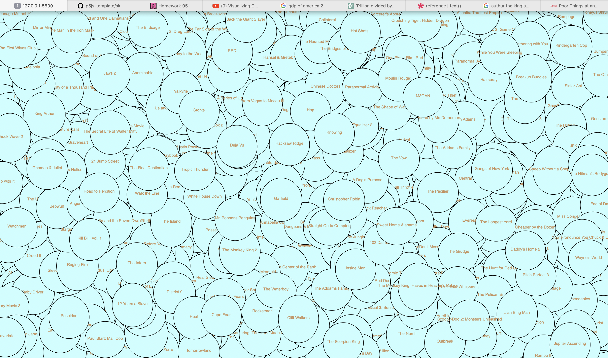

# Thinking & Research
I first viewed Kagel and the NYC data pool to try to find some interesting datasets. I failed because most of the ones I clicked on have data points fewer than 1000. Then a thought came to me: I can just search for key words "top 1000." I found this dataset of Top 1000 Highest Grossing Movies (up to date as of 25th September 2023).  

Then I viewed the CSV file in Numbers. I watched a YouTube video (https://www.youtube.com/watch?v=hokTcLVtZs8) to learn how to load the table. My pseudo code would be:  
1. Load table into the deck
2. Use array or state and push() etc. to have a list to call from
3. subtract the parameters I'd like to use
4. use the list to draw


# Started Exploring
I was exciting to receive console result from console log in.   
  

Then, I did a few moves to further explore a table in p5. 
  It's so satisfying to have a computer presenting info for me.  

I want to visualize the data of movies' world sales in $. My new pseudo code would be:  
1. extract the column numbers from dataset
2. Use ratio to make $ smaller so it can be drawn on the screen
3. draw shapes to visualize the data 

# Visualization 1
After the amount of time spending on understanding table(), I'm glad I can have something on my canvas. 
  


# Visualization 2
  

I used the division method by devide getNum/300000 to get the size of ovals. 


# Optimization
Then, I came to your office hour. After our talk, I:
1. map the max and min of data column directly to drawable numbers
2. map the color [fixI]
3. Changed all getString() to getNum  
Here is the only problem: the numbers generated from min() and max() functions are not the actual right numbers, so I manually used Excel. 
    
The circles are overlapping. ->

# The Final
  
In this visual, the width of circles reflects World Wide Sales (in $) and the height reflects International Sales (in $). The deeper the color is, the larger the International Sales is. 


# p5.js Template

This is a README file that can be used to describe and document your assignment.

Markdown Cheatsheet (from [https://www.markdownguide.org/cheat-sheet/](https://www.markdownguide.org/cheat-sheet/)):

---
---

# Heading1
## Heading2
### Heading3
#### Heading4
##### Heading5
###### Heading6

**bold text**

*italicized text*

~~strikethrough text~~

Ordered List:
1. First item
2. Second item
3. Third item

Unordered List:
- First item
- Second item
- Third item

`short code block`

```
extended code block
fun() {
  return 0
}
```

Link:  
[linked text](https://www.example.com)


Image with url:  


Image on repo:  


To start a new line, add two spaces at the end of a line, like this:  
this is a new line.


To start a new paragraph, leave an empty line between two lines of text.

This is a new paragraph.
